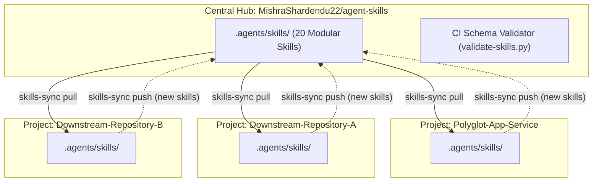

<div align="center">

# Autonomous AI Agent Skills Catalog

### Production-Grade Skills, Guardrails & Workflows for Antigravity, Claude, Jules, Cursor & AI Engineers

[](LICENSE)
[](#master-skills-catalog)
[](#)
[](.github/workflows/validate.yml)
[](#cross-repository-synchronization-engine)

<p align="center">
  <b>A library of autonomous AI agent skills, deterministic runbooks, pre-commit reflexes, and safety protocols with zero-friction bi-directional cross-repository synchronization.</b>
</p>

---

</div>

## Table of Contents

- [Overview](#overview)
- [Architecture & Hub-and-Spoke Sync](#architecture--hub-and-spoke-sync)
- [Quick Start & Installation](#quick-start--installation)
- [Master Skills Catalog](#master-skills-catalog)
  - [1. Communication Standards & Core Protocols](#1-communication-standards--core-protocols)
  - [2. Autonomous Git & Version Control](#2-autonomous-git--version-control)
  - [3. AI Engineering & Autonomous Review](#3-ai-engineering--autonomous-review)
  - [4. DevOps, Tooling & CI/CD Pipelines](#4-devops-tooling--cicd-pipelines)
  - [5. Code Quality, Testing & Simplification](#5-code-quality-testing--simplification)
  - [6. System Architecture & SaaS Systems](#6-system-architecture--saas-systems)
- [Using skills-sync CLI](#using-skills-sync-cli)
- [Automating Cross-Repo Sync via GitHub Actions](#automating-cross-repo-sync-via-github-actions)
- [Creating a New Skill](#creating-a-new-skill)
- [Contributing](#contributing)
- [License](#license)

---

## Overview

When building applications with AI coding agents (such as Google Antigravity, Google Jules CLI, Claude Code, or Cursor), standard prompts frequently suffer from context drift, forgotten pre-commit checks, fragmented branch management, and conversational filler.

This repository provides **20 modular, tested agent skills** following the open **`SKILL.md` specification**. Each skill defines:
1. **Trigger Semantics**: YAML frontmatter describing precise activation conditions.
2. **Explicit Safety Directives**: Alerts (`[!IMPORTANT]`, `[!WARNING]`) enforcing non-negotiable boundaries.
3. **Deterministic Runbooks**: Shell-verified commands and code recipes.
4. **Autonomous Convergence**: Self-verification tests and linters for independent execution.

---

## Architecture & Hub-and-Spoke Sync

All skills are maintained centrally in this repository (**Hub**). Downstream development projects (**Spokes**) can pull skills or push newly authored skills back to the hub using the portable `skills-sync` engine.



---

## Quick Start & Installation

### 1. One-Line Global CLI Install
Install the portable `skills-sync` CLI directly into `~/.local/bin`:

```bash
curl -fsSL https://raw.githubusercontent.com/MishraShardendu22/agent-skills/main/scripts/install.sh | bash
```

### 2. Pull Skills into Any Project
Navigate to any git repository and run:

```bash
skills-sync pull
```
This populates `.agents/skills/` with the entire catalog.

---

## Master Skills Catalog

### 1. Communication Standards & Core Protocols

| Skill | Description | Direct Link |
| :--- | :--- | :--- |
| `professional-communication-standard` | Enforces strictly emoji-free, concise, objective, and technically rigorous responses without fluff or conversational preambles. | [`.agents/skills/professional-communication-standard`](.agents/skills/professional-communication-standard/SKILL.md) |

### 2. Autonomous Git & Version Control

| Skill | Description | Direct Link |
| :--- | :--- | :--- |
| `git-branch-management` | Rules and procedures for creating, naming, structuring, and navigating Git branches. | [`.agents/skills/git-branch-management`](.agents/skills/git-branch-management/SKILL.md) |
| `git-commit-workflow` | Commit design taxonomy, semantic commit formatting, and mandatory GPG signing. | [`.agents/skills/git-commit-workflow`](.agents/skills/git-commit-workflow/SKILL.md) |
| `pull-request-management` | Runbooks for authoring and managing clean PRs targeting `main` with PR consolidation. | [`.agents/skills/pull-request-management`](.agents/skills/pull-request-management/SKILL.md) |
| `github-pr-issue-automation` | Auto-assignment, conventional label categorization, and GitHub markdown standards. | [`.agents/skills/github-pr-issue-automation`](.agents/skills/github-pr-issue-automation/SKILL.md) |
| `git-post-merge-cleanup` | Post-merge branch synchronization, stale branch pruning, and repository garbage collection. | [`.agents/skills/git-post-merge-cleanup`](.agents/skills/git-post-merge-cleanup/SKILL.md) |

### 3. AI Engineering & Autonomous Review

| Skill | Description | Direct Link |
| :--- | :--- | :--- |
| `jules-ai-engineering-workflow` | Autonomous Jules AI review loop across 38 architectural dimensions for Tech Lead delegation. | [`.agents/skills/jules-ai-engineering-workflow`](.agents/skills/jules-ai-engineering-workflow/SKILL.md) |
| `agent-observatory-workflow` | LangChain tool-calling, Tool-Calling RAG workflows, pgvector search, and HITL protocols. | [`.agents/skills/agent-observatory-workflow`](.agents/skills/agent-observatory-workflow/SKILL.md) |
| `doc-synchronization` | Autonomous synchronization of documentation, changelogs, and skills without human prompting. | [`.agents/skills/doc-synchronization`](.agents/skills/doc-synchronization/SKILL.md) |

### 4. DevOps, Tooling & CI/CD Pipelines

| Skill | Description | Direct Link |
| :--- | :--- | :--- |
| `docker-first-architecture` | Enforces multi-stage production Dockerfiles, optimal toolchains (pnpm, uv, static Go), and Docker Hub automation. | [`.agents/skills/docker-first-architecture`](.agents/skills/docker-first-architecture/SKILL.md) |
| `ci-cd-workflow` | Multi-environment CI/CD workflows, Docker Hub publishing, Render & Vercel deployments. | [`.agents/skills/ci-cd-workflow`](.agents/skills/ci-cd-workflow/SKILL.md) |
| `cli-tooling-guide` | Standard operating guide for authenticated CLI tools (`gh`, `jules`, `vercel`, `neonctl`, `docker`). | [`.agents/skills/cli-tooling-guide`](.agents/skills/cli-tooling-guide/SKILL.md) |
| `modern-toolchain-standard` | Standard operating specification: mandatory pnpm over npm, mandatory uv over bare pip, Biome, and Vitest. | [`.agents/skills/modern-toolchain-standard`](.agents/skills/modern-toolchain-standard/SKILL.md) |
| `precommit-workflow-management` | Maintain, configure, and execute intelligent multi-language pre-commit hook suites. | [`.agents/skills/precommit-workflow-management`](.agents/skills/precommit-workflow-management/SKILL.md) |

### 5. Code Quality, Testing & Simplification

| Skill | Description | Direct Link |
| :--- | :--- | :--- |
| `code-quality-and-validation` | Standards, formatters, linters, and static type checking for Go, Python, and TypeScript. | [`.agents/skills/code-quality-and-validation`](.agents/skills/code-quality-and-validation/SKILL.md) |
| `codebase-simplification-guide` | Architecture minimalism, dead code elimination, and abstraction reduction. | [`.agents/skills/codebase-simplification-guide`](.agents/skills/codebase-simplification-guide/SKILL.md) |
| `test-creation-and-execution` | Multi-layer test creation, mocks, integration testing, and agent eval test suites. | [`.agents/skills/test-creation-and-execution`](.agents/skills/test-creation-and-execution/SKILL.md) |
| `repository-maintenance` | Database integrity, idempotent migrations, backup verification, and dependency management. | [`.agents/skills/repository-maintenance`](.agents/skills/repository-maintenance/SKILL.md) |

### 6. System Architecture & SaaS Systems

| Skill | Description | Direct Link |
| :--- | :--- | :--- |
| `saas-and-mcp-architecture` | SaaS Connector Hub, encrypted secret vaults, cloud storage, and MCP tool expansions. | [`.agents/skills/saas-and-mcp-architecture`](.agents/skills/saas-and-mcp-architecture/SKILL.md) |
| `polyglot-microservice-architecture` | Polyglot architecture guidelines, service boundaries, pgvector hybrid search, and cloud deployments. | [`.agents/skills/polyglot-microservice-architecture`](.agents/skills/polyglot-microservice-architecture/SKILL.md) |

---

## Using skills-sync CLI

The `skills-sync` tool provides an interface for managing skills across any local repository:

```bash
# Pull latest skills from upstream hub into .agents/skills/
skills-sync pull

# List installed skills with descriptions
skills-sync list

# Scaffold a new skill template
skills-sync new database-auto-sync

# Validate all SKILL.md files for schema compliance
skills-sync validate

# Push a new skill back to the central hub
skills-sync push database-auto-sync

# Bidirectional sync (pull updates, push new local skills)
skills-sync sync
```

---

## Automating Cross-Repo Sync via GitHub Actions

To make any project automatically push new or modified skills back to `MishraShardendu22/agent-skills`, add `.github/workflows/sync-skills-upstream.yml` to your downstream repository:

```yaml
name: Sync Skills Upstream

on:
  push:
    branches: [ main ]
    paths: [ '.agents/skills/**', 'skills/**' ]
  workflow_dispatch:

jobs:
  sync:
    runs-on: ubuntu-latest
    steps:
      - uses: actions/checkout@v4
      - name: Push Skills Upstream
        env:
          AGENT_SKILLS_REPO: "MishraShardendu22/agent-skills"
          GITHUB_TOKEN: ${{ secrets.SKILLS_SYNC_TOKEN || secrets.GITHUB_TOKEN }}
        run: |
          curl -fsSL https://raw.githubusercontent.com/MishraShardendu22/agent-skills/main/scripts/skills-sync.sh | bash -s -- push
```

---

## Creating a New Skill

To author a new skill:
1. Run `skills-sync new <skill-name>`
2. Follow the standard template structure:
   ```markdown
   ---
   name: my-new-skill
   description: >-
     When to use this skill and what high-level workflows it accomplishes.
   ---

   # My New Skill Title

   ## 1. Overview
   ...

   ## 2. Core Directives & Rules
   ...

   ## 3. Step-by-Step Procedure
   ...
   ```
3. Run `skills-sync validate` to check syntax.
4. Run `skills-sync push my-new-skill` to contribute it back.

---

## Contributing

Contributions are welcomed. Please read [CONTRIBUTING.md](CONTRIBUTING.md) for details on code of conduct, skill validation requirements, and pull request process.

---

## License

This project is open source and available under the [MIT License](LICENSE).
Copyright (c) 2026 **Shardendu Mishra**.
