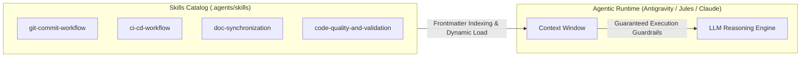
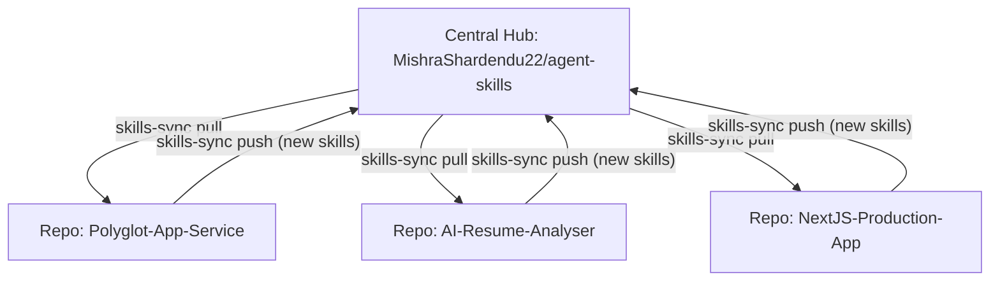

# Architecture of Autonomous AI Agent Skills

This document describes the architectural foundation, execution semantics, and cross-repository synchronization lifecycle of skills in the `agent-skills` ecosystem.

---

## 1. What is an AI Agent Skill?

An **AI Agent Skill** is a structured, markdown-encapsulated procedural protocol that augments Large Language Model (LLM) agents (such as Antigravity, Claude, Jules, Cursor, and custom LangChain agents) with deterministic domain runbooks, safety constraints, tool-calling sequences, and pre-commit reflexes.



---

## 2. Anatomy of a `SKILL.md`

Each skill directory contains a single source of truth: `SKILL.md`.

```yaml
---
name: <canonical-kebab-case-name>
description: >-
  Trigger condition and description loaded by agent indexers.
---
```

### Key Sections:
1. **Frontmatter**: Used by agent indexers to determine relevance and trigger conditions.
2. **Alert Guardrails (`[!IMPORTANT]`, `[!WARNING]`)**: Highlight hard safety boundaries that the LLM must never violate.
3. **Deterministic Runbooks**: Copy-pasteable, shell-verified commands and code templates.
4. **Autonomous Convergence**: Clear test/validation steps so the agent can independently verify its own work.

---

## 3. Cross-Repository Hub & Spoke Sync Architecture

To prevent duplication and fragmentation across multiple distinct codebases, `agent-skills` operates on a **Hub-and-Spoke Topology**:



### Sync Operations:
- **`pull`**: Clones the latest upstream release and copies skills into the downstream repository's `.agents/skills/` directory.
- **`push`**: Scans local `.agents/skills/` for new or modified skills and commits them upstream via Git or GitHub Actions.
- **`sync`**: Two-way reconciliation with SHA-256 collision checking.
